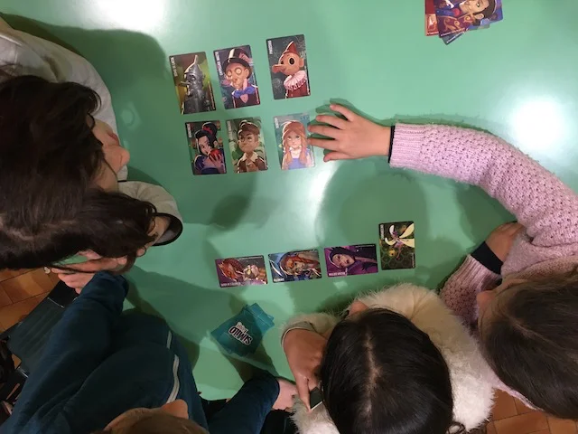

16 carte di personaggi di fantasia e bisogna individuare il personaggio segreto grazie a due tipi di indizi: è simile o non è simile ad altri personaggi. semplicissimo. bellissimo.

> [!tip] Fabio
> Facilissimo, bellissimo, e si approfondiscono molti personaggi di fantasia o storici o mitici (noi li abbiamo tutti e tre)

> [!info] Stefano
> Imprescindibile. Sopratutto l'edizione Stora o Miti.
