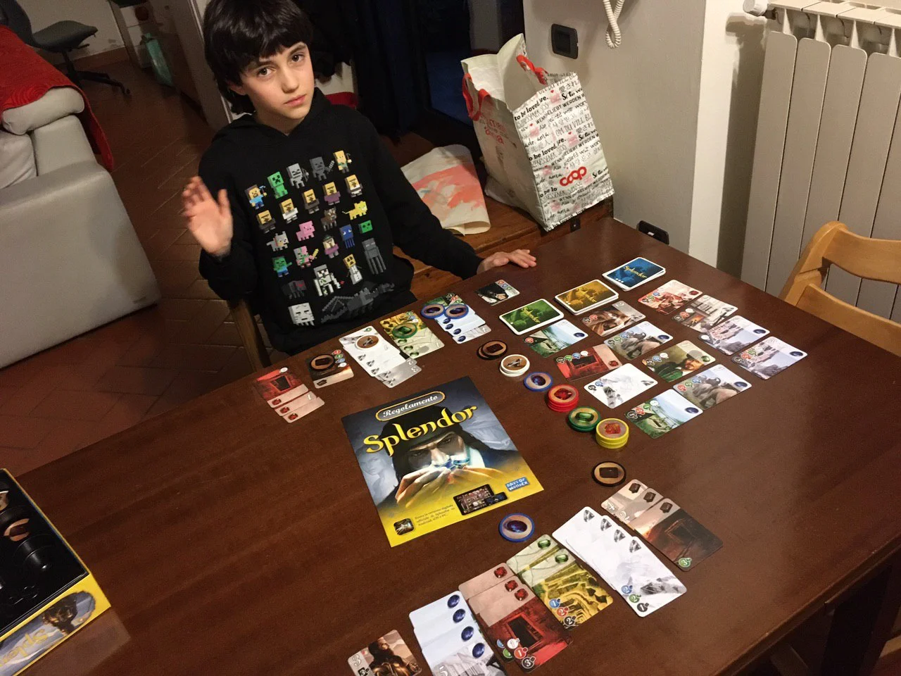

Dateci retta: compratelo senza indugio.
Le componenti sono splendide, è facile da imparare, è profondo.

È giocabile in modo facile dai bambini, ma per goderselo pienamente forse meglio avere 10 anni, perché una volta superata la superficie, si aprono infinite ricerche di strategie e tattiche.

Noi l'abbiamo giocato tanto anche sul tablet perché ci sono le missioni avanzate (acquistabili separatamente anche in scatola ndr)

> [!tip] Fabio
> è innanzitutto bello e abbastanza semplice ma non banale

> [!info] Stefano
> Adoro gli Space Cowboys (game designers francesi)

## Video tutorial

