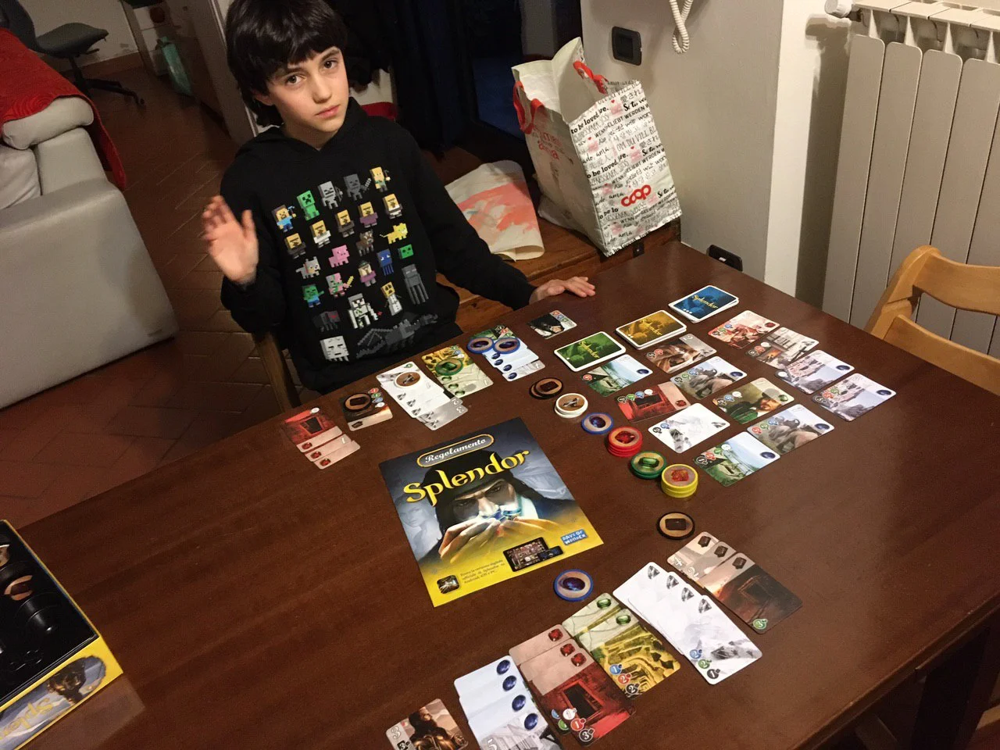

> #Family #Carte #Matematica #Nonni #Award   
> 2-4g | 7+ | 30m | facile-medio | [scheda](https://www.boardgamegeek.com/boardgame/148228/splendor)  

Dateci retta: compratelo senza indugio.
Le componenti sono splendide, è facile da imparare, è profondo.

È giocabile in modo facile dai bambini, ma per goderselo pienamente forse meglio avere 10 anni, perché una volta superata la superficie, si aprono infinite ricerche di strategie e tattiche.

Noi l'abbiamo giocato tanto anche sul tablet perché ci sono le missioni avanzate (acquistabili separatamente anche in scatola ndr)

> *Fabio:*
> è innanzitutto bello e abbastanza semplice ma non banale

> *Stefano:*
> Adoro gli Space Cowboys (game designers francesi)

