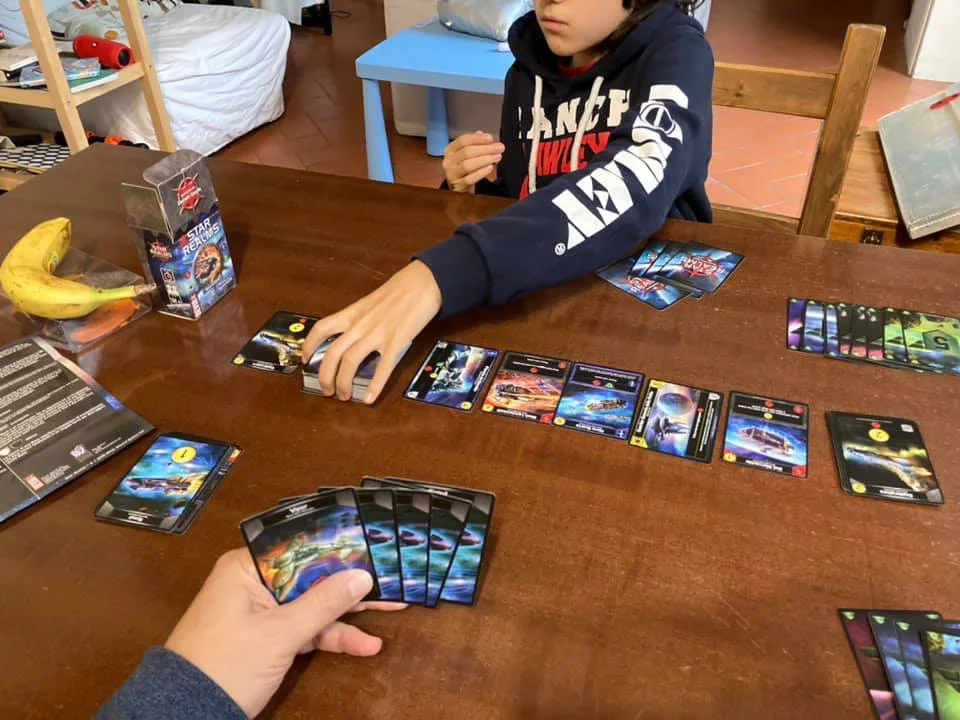

> **#Carte #2Giocatori #Spazio #Award**  
> 2-4g | 8+ | 20m | medio | [scheda](https://www.boardgamegeek.com/boardgame/147020/star-realms)  

volevamo un gioco di carte veloce di tipo spaziale (ma c'è anche la versione "fantasy" Hero Realms).
capisco perché è un pluripremiato, con dozzine di espansioni se il deck base inizia ad essere troppo base :)

> *Fabio:*
> tantissime astronavi, bella grafica e sopratutto devi creare il tuo mazzo

