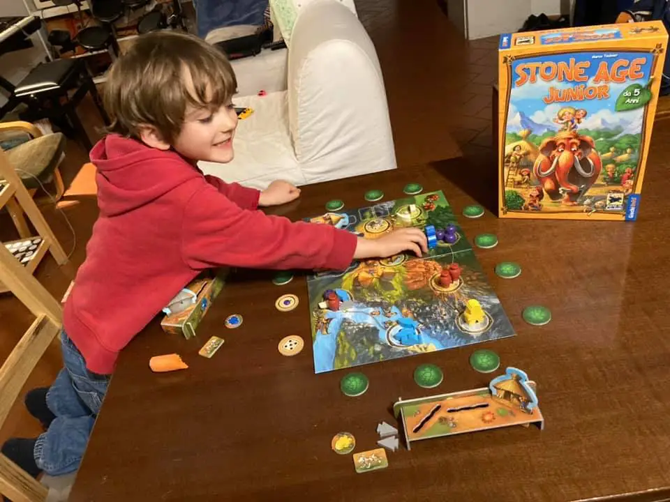

un altro gioco non banale, con elementi di strategia, aritmetica, combinatoria e memoria che un cinquenne afferra in pochi minuti. 

ci sono tre meccaniche molto semplici che si intrecciano molto bene, e l’ambientazione preistorica è davvero coinvolgente, i materiali perfetti, con rapporto qualità/prezzo davvero buono

> *Bruno:* mi piace costruire le capanne e c'è anche il cagnolino che ti aiuta!
{.boxFabio}

> *Stefano:* approvato e in top 10 family games!
{.boxStefano}
