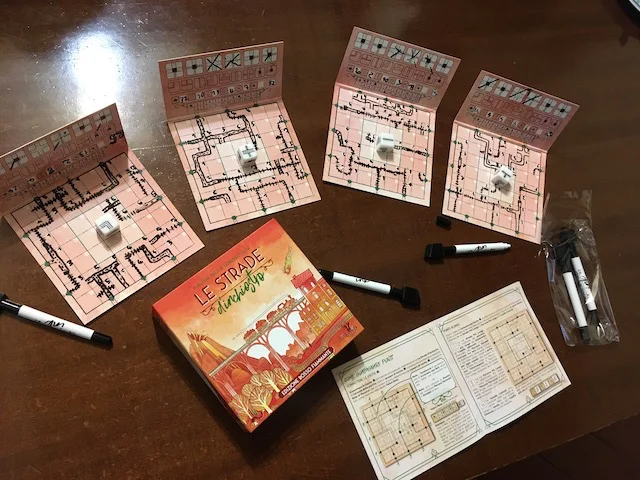

> **#Party #Visuale**   
> 1-6g | 8+ | 30m | facile | [scheda](https://www.boardgamegeek.com/boardgame/251678/railroad-ink-blazing-red-edition)  

costruire labirinti di rotaie da comporre nel modo ottimale per massimizzare i punti.
penna e matita e creatività tattica.

> *Fabio:*
> bello disegnare le tue strade

