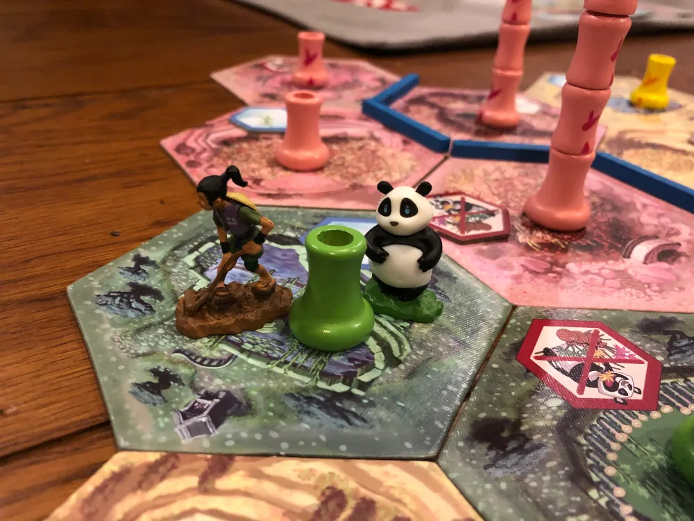

Coltiva il bambù e dai da mangiare al panda affamato.
Esteticamente bellissimo con le miniature e la plancia di gioco sempre diversa.  
Si impara facile e necessita quel minimo di strategia e di matematica per vincere.

> *Stefano:*
> Ogni tanto i giochi con componenti belle da vedere e da toccare e con un'ambientazione pucciosa, può essere una chiave per coinvolgere i giocatori a sedersi al tavolo
