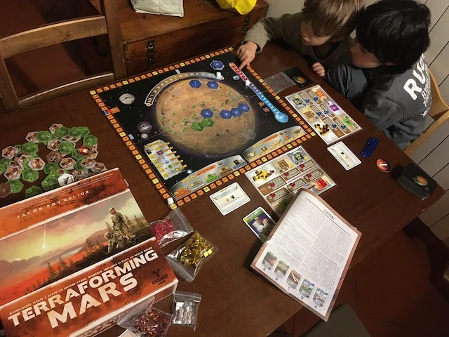

Il secondo *peso medio*, ovvero "giocone", della nostra ludoteca.
È un capostipite del genere strategico / gestionale e acclamato titolo sul tema spazio e Marte. Non è semplice (diciamo che devi essere un 11enne abbastanza nerd per goderlo) ma è proprio questo il suo bello

Se piace ha poi molte espansioni e sopratutto lo gioca mezzo mondo.. quindi è un "lasciapassare" nel caso di globetrotters ludici!

