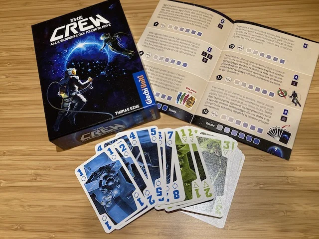

prendi la Briscola, e rendila cooperativa con 50 missioni spaziali.
il bello di questo gioco è che la meccanica di base la conosciamo tutti.
ma il "twist" geniale è stato creare una serie (con tanto di storia!) di micromissioni obiettivo che i giocatori devono ottenere per vincere il round, trasformando la competizione in una cooperazione.

che dire: è il gioco dell'anno
