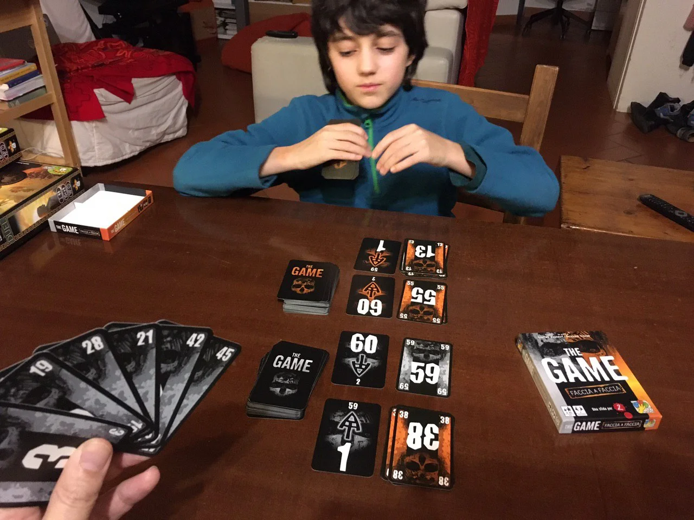

> **#Family #Carte #Matematica #Solo #Collaborativo #Award**     
> 1-5g | 6+ | 20m | facile | [scheda](https://boardgamegeek.com/boardgame/182453/game-fire-compilation)   

Un semplice mazzo di carte che vi farà collaborare per finire questo "solitario multigiocatore", il capostipite di molti altri giochi della serie.

> *Fabio:*
> Devi solo saper contare fino a 100 e fare le addizioni e sottrazioni.

> *Stefano:*
> Adoro i giochi estremamente semplici ma geniali.

