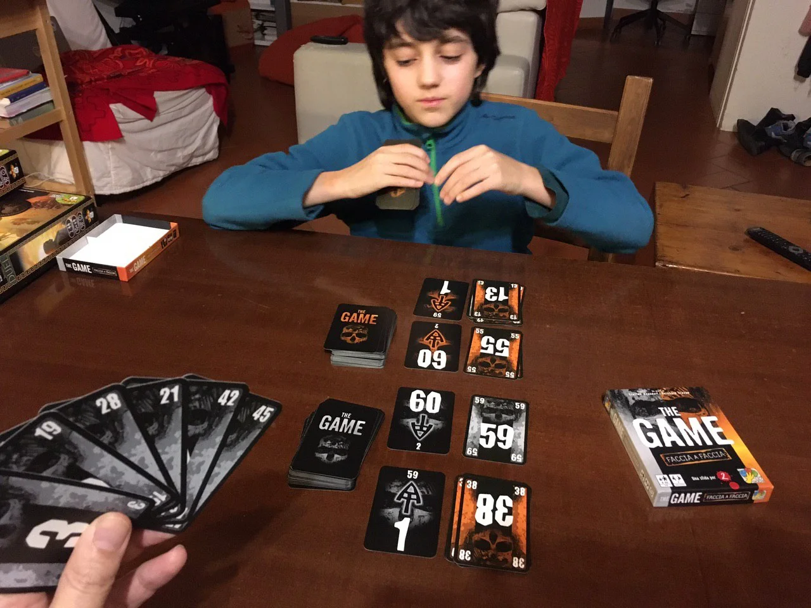

Un semplice mazzo di carte che vi farà collaborare per finire questo "solitario multigiocatore", il capostipite di molti altri giochi della serie.

> [!tip] Fabio
> Devi solo saper contare fino a 100 e fare le addizioni e sottrazioni.

> [!info] Stefano
> Adoro i giochi estremamente semplici ma geniali.
