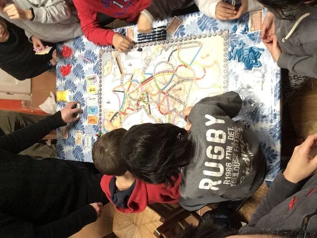

È probabilmente uno dei *nuovi classici*, perché ce l'hanno tutti e tutti lo giocano. Forse un motivo ci sarà!

Un gioco strategico molto semplice, quindi adatto a tutti, che vi farà girare per le capitali d'Europa, o del mondo.. dipende dall'edizione che si compra.

> *Fabio:*
> è bello ripassare la geografia così

> *Stefano:*
> C'è anche una versione kids e molte edizioni con geografie diverse. Nel dubbio sceglierei l'Europa.
