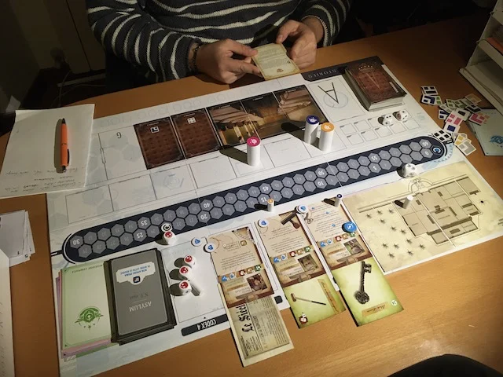

> **#Narrativo #Avventura #Serie**  
> 2-4g | 12+ | 2h | medio | [scheda](https://boardgamegeek.com/boardgame/146508/time-stories)   

si collabora tutti nell'avventursi nel tempo per risolvere missioni. neessita una buona conversazione con i compagni di viaggio.

Unico neo che finita un'avventura, le altre sono moduli opzionali da acquistare separatamente

