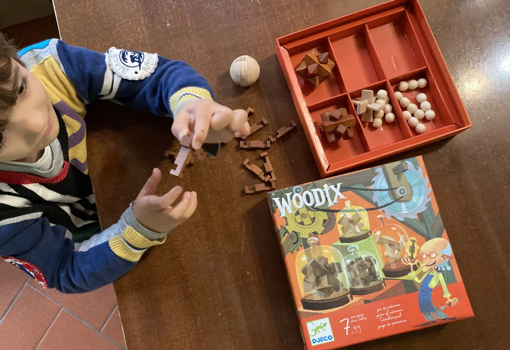
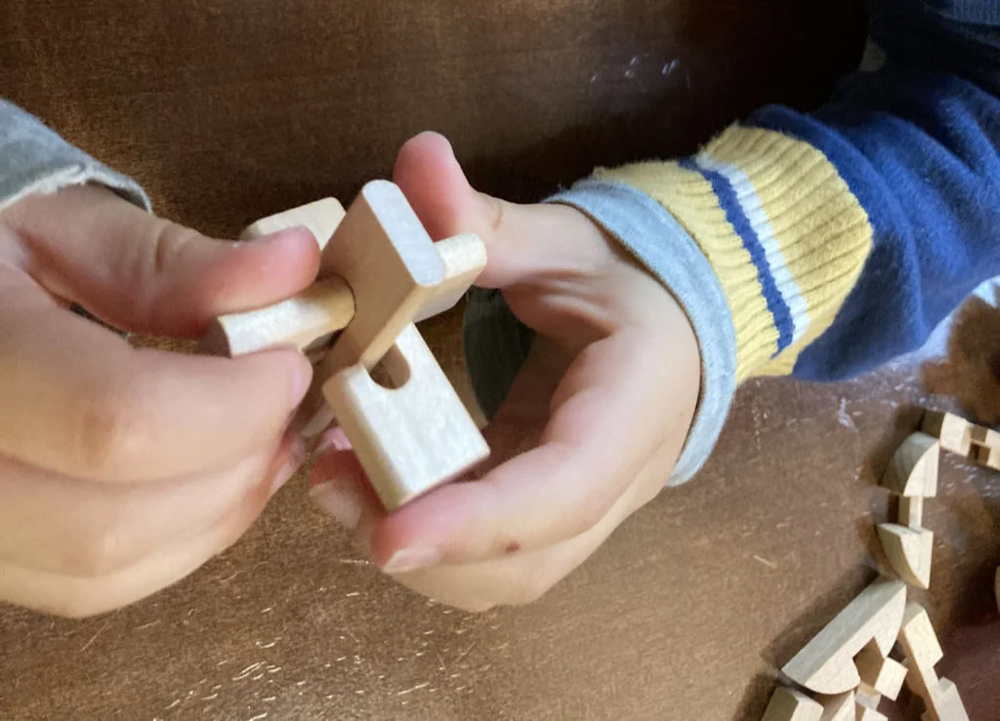

6 rompicapo in legno dalla Djeco

> [!tip] Fabio sono diversi, ed è bello farli insieme ad altri, aiutarsi (per alcuni non bastano due mani!)

> [!info] Stefano non me l'aspettavo che piacessero tantissimo anche al piccolo Bruno, che li chiede.

