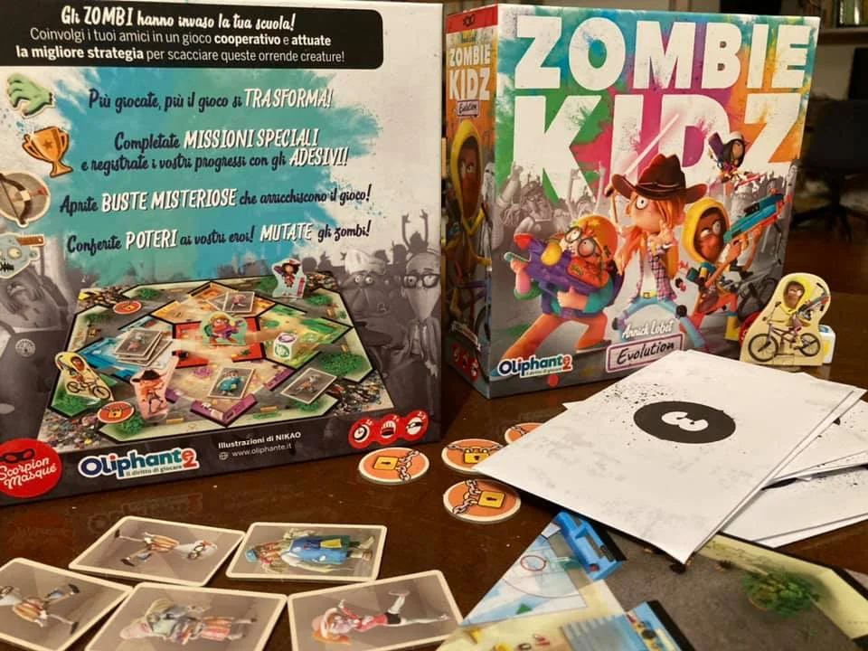
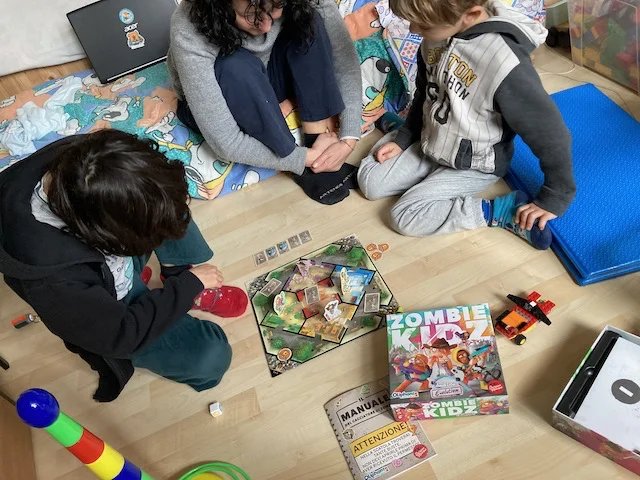

*I ragazzi devono difendere la scuola da un'invasione zombie!*  
Per noi il gioco dell'anno e geniale perchè si parte con regole minime facilissime per giocare a chiudere i cancelli prima dell'ecatombe, e dopo ogni 5 partite si sbloccano regole aggiuntive e poteri speciali (stanno dentro a delle buste segrete), con tantissimi adesivi da appicciare per vedere i propri progressi.

Grafica e personaggi eccellenti, meccaniche divertenti per grandi e piccoli, gratificante. Costa pure poco.

> [!tip] Fabio
> Sbloccare nuove regole e poteri dopo un po' che giochi e gli zombies a scuola piace sia a me che a mio fratello

> [!info] Stefano
> Capolavoro. Stimola davvero l'azione di squadra

