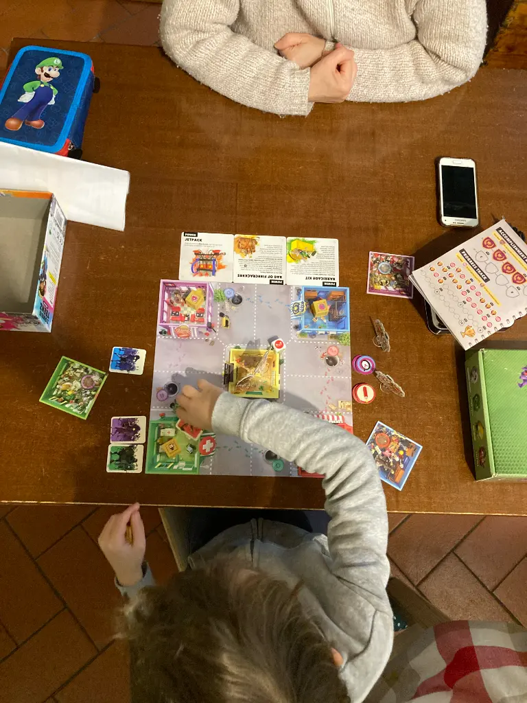

**Zombie Teenz** è il nostro gioco definitivo (del momento)

perché le partite sono velocissime (10 min), si collabora (e quindi si dialoga molto), ha poche mosse ma intelligenti, e più giochi più si sbloccano nuove regole e nuovi scenari, come il cagnolino 🐶 che lo puoi lanciare ad azzannare le caviglie dei mostri.

queste regole "progressive" (in gergo si chiamano giochi "legacy") sono un manna: perché il gioco lo intavoli in due minuti.. e più giochi, più diventi bravo e più vuoi nuove opzioni e sapere di più sulla storia. è il segreto dei videogiochi però trasferito in un gioco da tavolo.

e poi ci sono gli zombies che con i loro salti ci mettono una bella ansia tanto che abbiamo perso due partite di seguito!

non mi sembra ci sia ancora in italiano, il nostro è in inglese ma meglio così, tanto già in seconda elementare fanno più inglese di quanto ne facevo io in seconda media. 

anzi sapete cosa: da oggi comprerò solo giochi in lingua originale (ops gli editori italiani mi malediranno ora 🙂

Si può combinare con [Zombie Kids](zombie-kids-evolution.md) per un gioco stratosferico.

I ragazzi lo hanno eletto loro gioco preferito.
