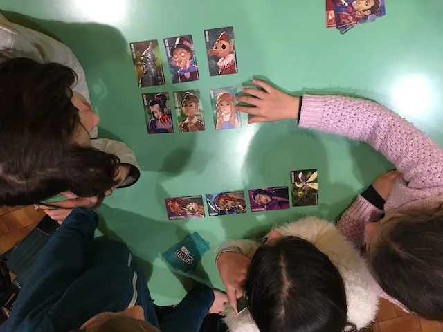

> **#Kids #Carte #Award**   
> 4-6g | 5+ | 20m | facile | [scheda](https://boardgamegeek.com/boardgame/268620/similo)  

16 carte di personaggi di fantasia e bisogna individuare il personaggio segreto grazie a due tipi di indizi: è simile o non è simile ad altri personaggi. semplicissimo. bellissimo.

> *Fabio:*
> Facilissimo, bellissimo, e si approfondiscono molti personaggi di fantasia o storici o mitici (noi li abbiamo tutti e tre)

> *Stefano:*
> Imprescindibile. Sopratutto l'edizione Stora o Miti.

