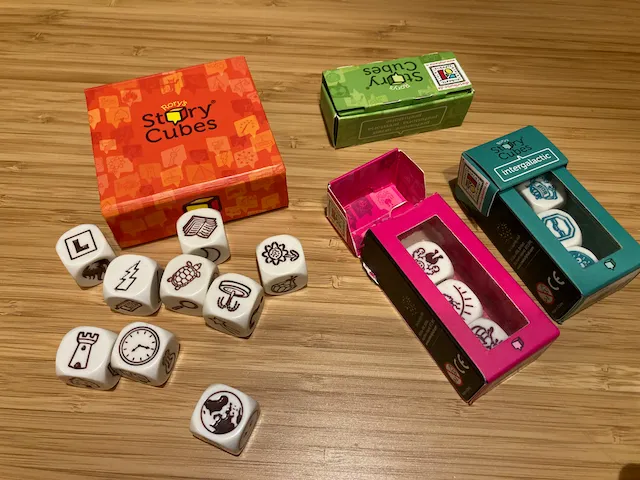

> **#Kids #Narrativo #Fantasia**   
> 1-8g | 4+ | 15m | facile | [scheda](https://www.boardgamegeek.com/boardgame/20545/rorys-story-cubes)  

I dadi hanno diversi disegni e icone. Li tiri e devi inventare una storia che li contenga.
Oppure in successione ogni giocatore aggiunge un dato, proseguendo la storia.
Serve altro?

> *Fabio:*
> incredibile inventare storie a partire da disegni anche stranissimi.. e più ne hai meglio è!

> *Stefano:*
> Quando lo scoprii ormai 10 anni fa capii che era iniziata una nuova era per la creatività

