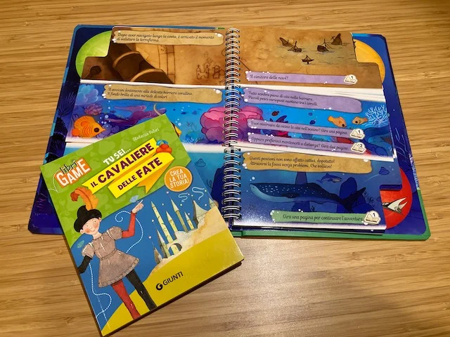

Ci sono già diversi libri di questa serie (noi abbiamo *Il Tesoro di Atlantide* e *Missione nello spazio*) che ha un meccanismo davvero originale per scegliere il percorso, con le pagine tagliate in 3 sezioni.
La progressione è semplice, ma la grafica, la carta plastificata, il vedere tutto in una pagina, fa di questi libri una bella esperienza da laggere insieme ai più piccoli

Nella foto c'è anche un libro della serie "Tu Sei..." altrettanto carino, con qualche elemento in più di GdR, ovvero crei il tuo personaggio
