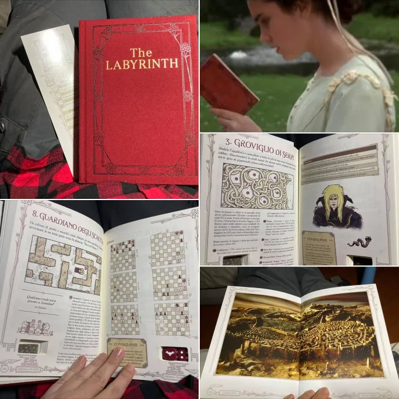

The Labyrinth il libro avventura è davvero un gioiellino.
E' praticamente un gioco di ruolo per un gruppo di giocatori ambientato nel mondo di The Labyrinth (il famoso film) ed è il primo libro che vedo avere un compartimento segreto per i dadi 🙂

Bisogna essere almeno un due, uno impersona il Re dei Goblin (con adeguata parrucca) e gli altri gli avventurieri. Ma fosse anche solo per la copertina in stoffa e la fattura prevista, ispira assai.
