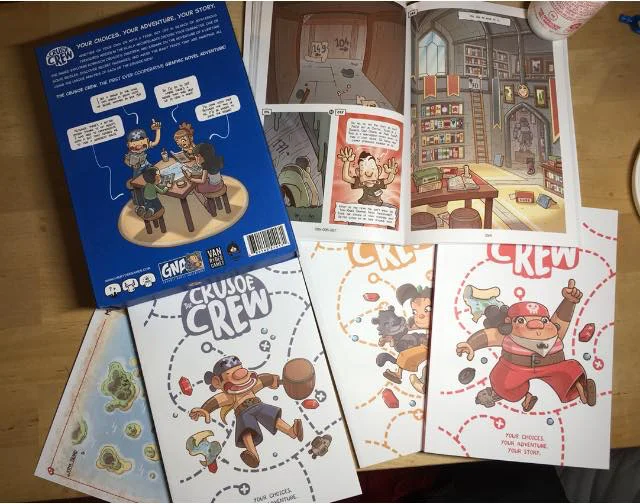

> **#Collaborativo #Narrativo #English**  
> 1-4g | 45m | facile | [scheda](https://www.boardgamegeek.com/boardgame/244274/crusoe-crew)  

può esistere un fumetto da leggere in 4 ognuno il suo personaggio che si intreccia le storie con gli altri?

il format è semplice, la grafica bellissima. la storia coinvolgente.
adatto ai bambini direi dalla quarta elementare.

potete immaginare come dare in mano a 4 ragazzini un libro a testa e dire loro: INIZIATE LA VOSTRA AVVENTURA e vederli leggere a voce alta e discutere insieme come proseguire la storia, è qualcosa di abbastanza innovativo e da voler sperimentare.

questo è in inglese. non cercatelo subito (salvo bimbi bilingui)

