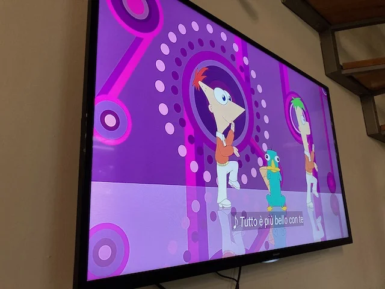

E' una delle serie di cartoni animati che più amiamo perché:

1. davvero intelligente con ottimi personaggi
2. molto musicale con canzoni orecchiabili
3. in ogni puntata progettano e costruiscono qualcosa
4. puntate cortissime
5. c'è un ornitorinco agente segreto
6. il "cattivo" è il genio del male più divertente al mondo
7. si capiscono bene anche in inglese

> [!tip] Fabio
> in ogni puntata costruiscono qualcosa di nuovo

