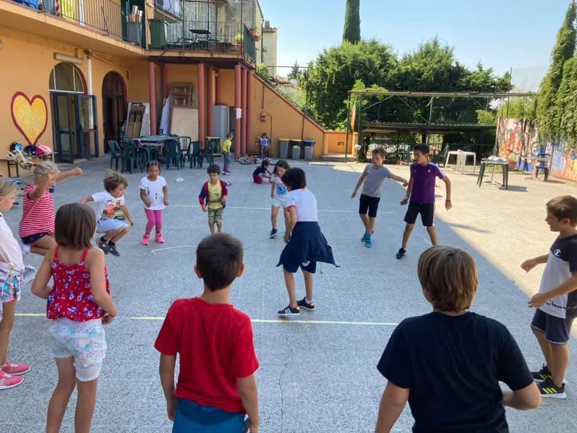

Una semplice **corda** di 6 metri.

Sono innumerevoli i giochi che si possono fare: il più divertente è l”OROLOGIO” dove uno gira in tondo e tutti a saltare eliminati se toccati, poi la gara a chi fa più salti (record 84) ma anche tiro alla fune o il LIMBO! magari domani si fa l'arrosto gigante 🙂

Il bello è che ha entusiasmato anche i più fanatici del calcio.
Poi abbiamo fatto un bel ripasso dei nodi fondamentali perché ammettiamolo: è importante saper fare i nodi.

Tutto con una corda. 
