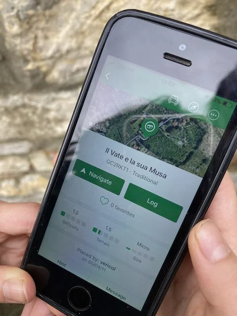
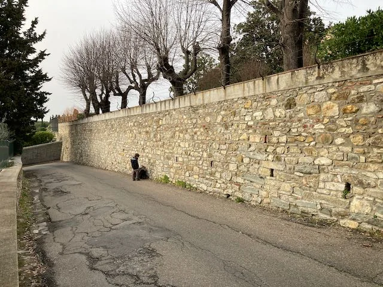
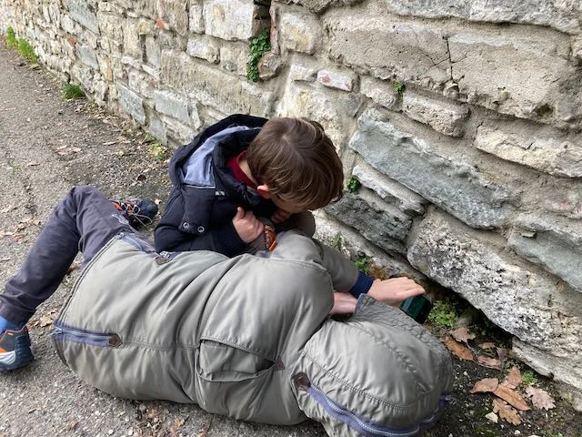

- ho un pò paura ad infilare la mano lì dentro
- "la paura uccide la mente". non aver paura. (e tranquillo ho già verificato che non ci siano vipere 🐍
- niente
- allora su.. c'è da controllare tutto il muro!
oggi Fabio ci ha fatto fare una "caccia la tesoro". con i suoi amici si stanno appassionando a #Geocaching: in pratica è un'app con una mappa mondiale di migliaia di locazioni dove la gente ha nascosto dei "tesori", indicandone la zona e qualche indizio.
Intorno a casa nostra (a quasi 2 Km) ce ne era uno e così siamo partiti alla ricerca.
La mappa indicava questo muro (per la cronaca è il muro della Villa Capponcina, famosa perché residenza di Gabriele D'Annunzio a inizio '900 con dirimpettaia la Duse 😊 )
dopo un'ora di ricerche non l'abbiamo trovato.. sebbene a ottobre qualcuno l'avesse trovato (funziona che uno trova il tesoro, lo apre.. qualsiasi cosa sia.. e poi lo risistema come l'ha trovato per permetter a nuovi cercatori di divertirsi). ci tornerà con i suoi amici, con torcia più potente ed una paletta.
è davvero un "gioco" geniale. planetario, che permette di dare delle piccole mete alle passeggiate, o di iniziarne di nuove apposta, e conoscere il territorio.
Anche il piccolo Bruno si è divertito a spostare tutti i sassi e cercare indizi.
Presto ne creeremo una anche noi vicino casa. così potete venire a trovarci per una tisana premio (solo se lo troverete, ovvio)
cercate Geocaching e buone avventure!
