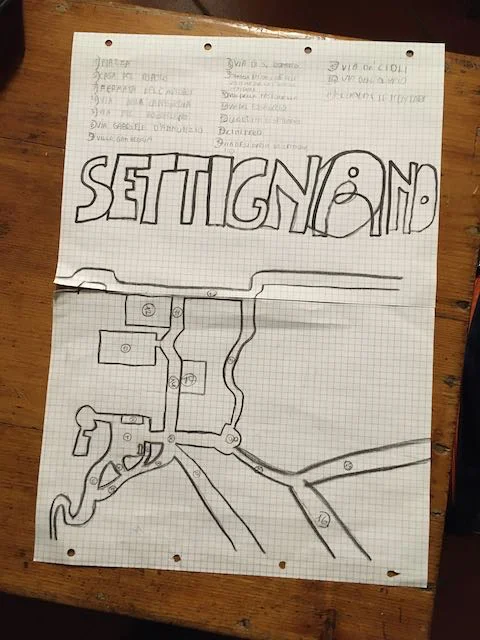

Non pretendiamo di diventare tutti cartografi, ma la pratica di "mappare" l'ambiente che ci circonda può aiutarci a ricordarci il dove siamo e il contesto. Le distanze, gli ostacoli, la memoria.

Lo si può fare in una pausa quando si è in giro, oppure una volta tornati a casa.

