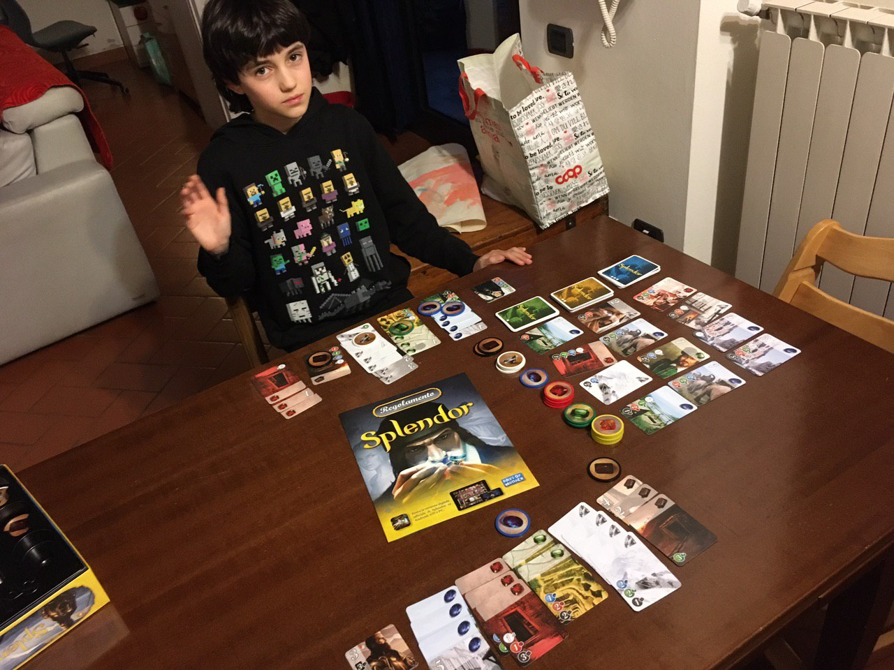

l'avevamo provato e studiato sul tablet (3 euro benissimo spesi) e avevamo capito che ci piaceva.

ordinato dal nostro negozio di giochi di fiducia, occupa lo spazio di una merenda, non più di 25 minuti, si gioca in 2, 3 ,o 4

è fondamentalmente un gioco di tattica matematica, per acquisire le carte chiave per raggiungere 15 punti prima dell'avversario.
il gioco sviluppa molto lo "sguardo sinottico", ovvero guardare e analizzare le 20 carte sul tavolo per individuare la scelta migliore, e contemporaneamente la strategia per raggiungere i 15 punti: collezionare tante carte da pochi punti, o puntare a poche di alto valore?

si impara in 6 minuti e una partita tira l'altra. attenti!
fatevi un regalo e comprate la versione tablet.. direi dai 7 anni in su è godibilissima
