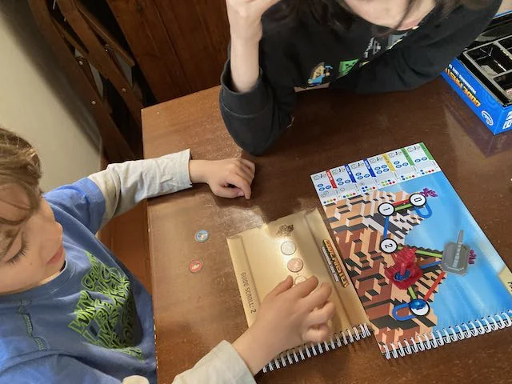
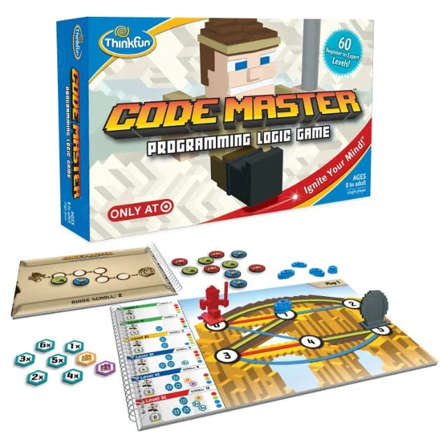

{: style="height:200px"}
{: style="height:200px"}

un gioco dove i 50 livelli si risolvono con procedure di programmazione logica sempre più elaborata.
semplice e geniale. quando lo hanno finito lo passano agli amici.
forse il miglior gioco di introduzione al coding

> *Fabio:* impari davvero a programmare! i livelli sono belli. e piace molto anche a Bruno! perché è proprio come se fosse un videogioco
{.boxFabio}

> *Stefano:* con il giusto coinvolgimento iniziale, perché non è un gioco che possono inziare da soli, poi se ingranano vanno alla grande
{.boxStefano}
