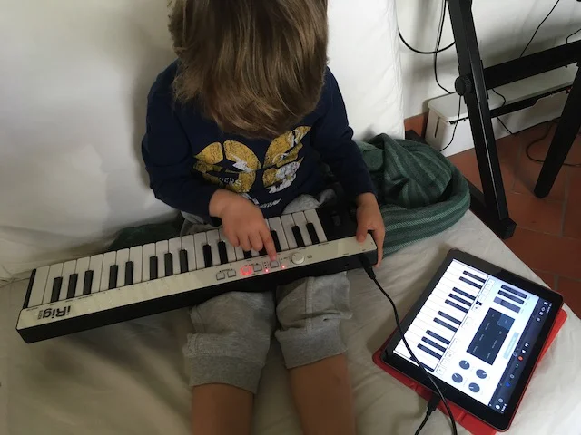

Non è un gioco.. ma ricordiamo che in inglese il verbo Play indica tanto il **giocare** quanto il **suonare** (uno strumento).

E parlando qui di giochi e app che vorremmo giocare il più possibile , GarageBand, che è un programma per creare musica con ogni tipo di strumento musicale e la propria voce, è davvero un capolavoro di semplicità e qualità sonora.

Possiamo suonare dai flauti indiani agli strumenti a corda cinesi alle percussioni giapponesi, sintetizzatori vintage (storici) o dirigere orchestre.

Credo esistono versioni equivalenti anche per Android, ma se avete un iPad, GarageBand è un dovere morale

