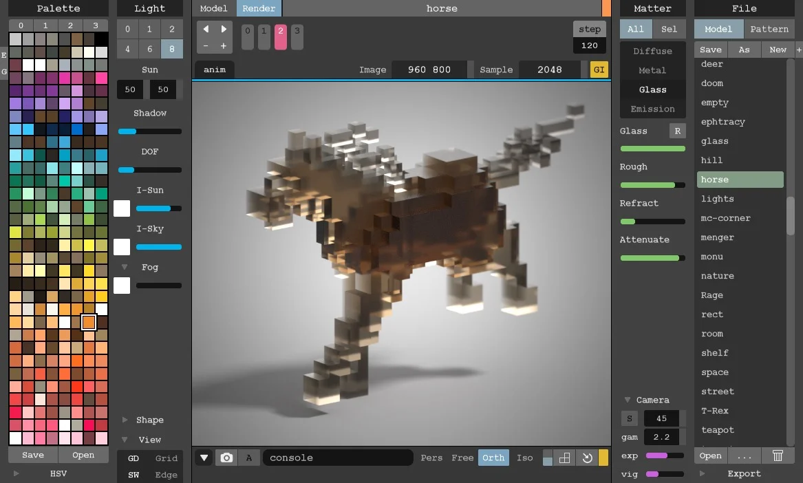
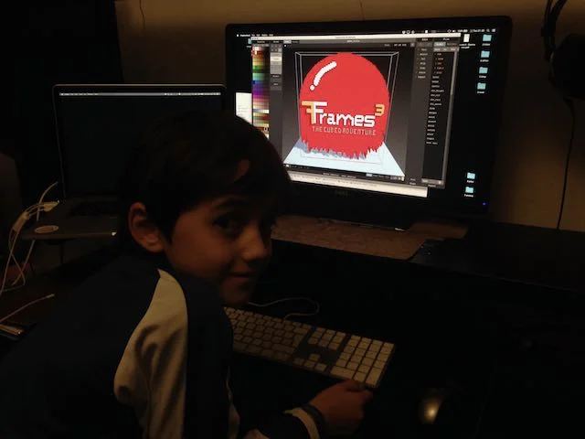

E' l'unico non gioco della lista ma lo metto perché è un programmino notevolissimo, gratuito, multipiattaforma, per "disegnare" in 3D con i Voxels, i pixels tridimensionali, stile Minecraft per intenderci.
I vostri figli ma anche voi vi divertirete come matti

> [!tip] Fabio
> con questo programma ho creato moltissime cose che poi sono entrate anche nei miei videogiochi
