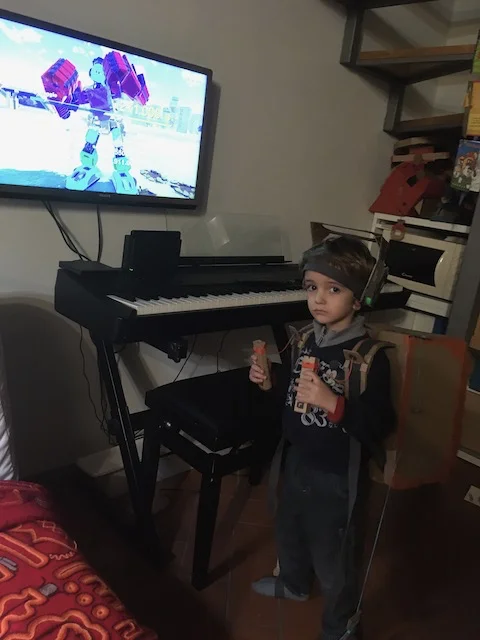
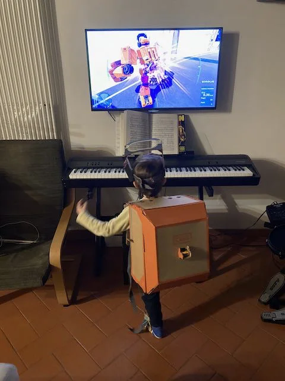
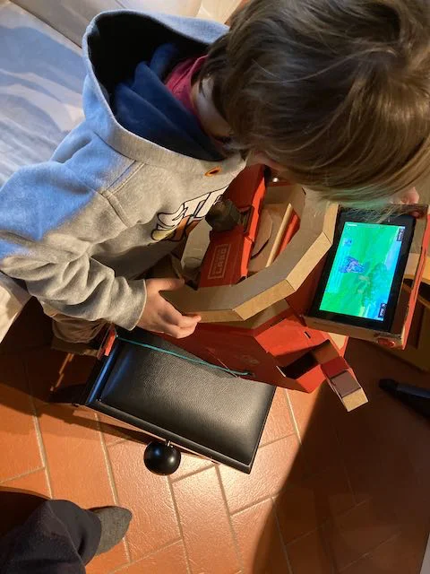

Quando espandi la tua consolle con aggeggi costruiti con il cartone. Geniale: dalla canna da pesca all'armatura da robot che ti proietta gigante a camminare nelle città.
al visore in VR con tanto di ambiente per creare i tuoi scenari e giochi (ci ho fatto un laboratorio con i ragazzi delle superiori.. bello)

> [!tip] Fabio
> bello costruire con il cartone e poi giocarci.. il cartone giocato!

