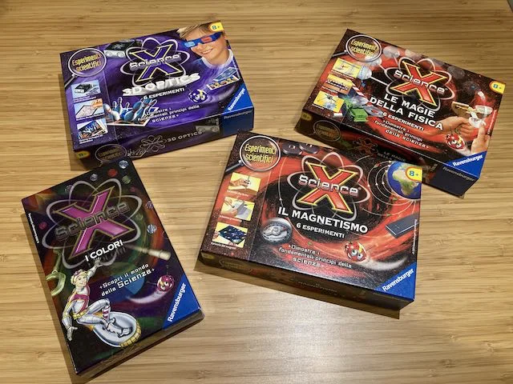
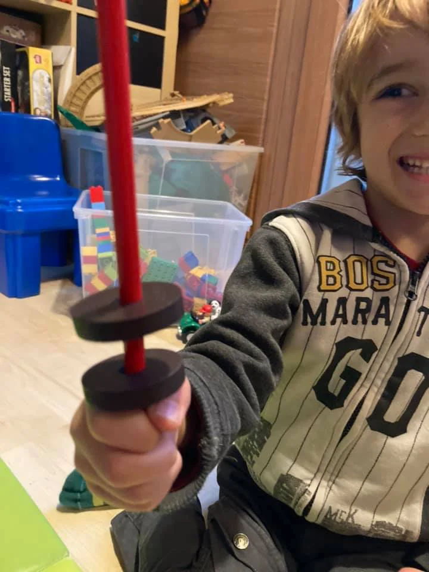

Sono molti i giochi ormai disponibili che trattano temi tecnici e scientifici.  
Ne avrete già visti diversi anche nei supermercati.
Più che il gioco in sé, il consiglio è quello di giocarli insieme.
Prendetene uno che interessi anche voi e mettete su un momento di studio / laboratorio.
I miei figli sono impazziti per quello dell'elettricità, del magnetismo, del vortice.. ma non tanto perché gli erano arrivate queste scatole magiche, quanto perché ci siamo entusiasmanti insieme.
Fatto una volta, poi loro si ricordano, copiano a memoria e iniziano a smanettare variazioni.

Ecco magari non comprate al risparmio scatole con dentro tutto.
Meglio giochi mirati su un tema.

Lisciani, Clementoni, Quercetti, KidzLab sono ottime marche.

