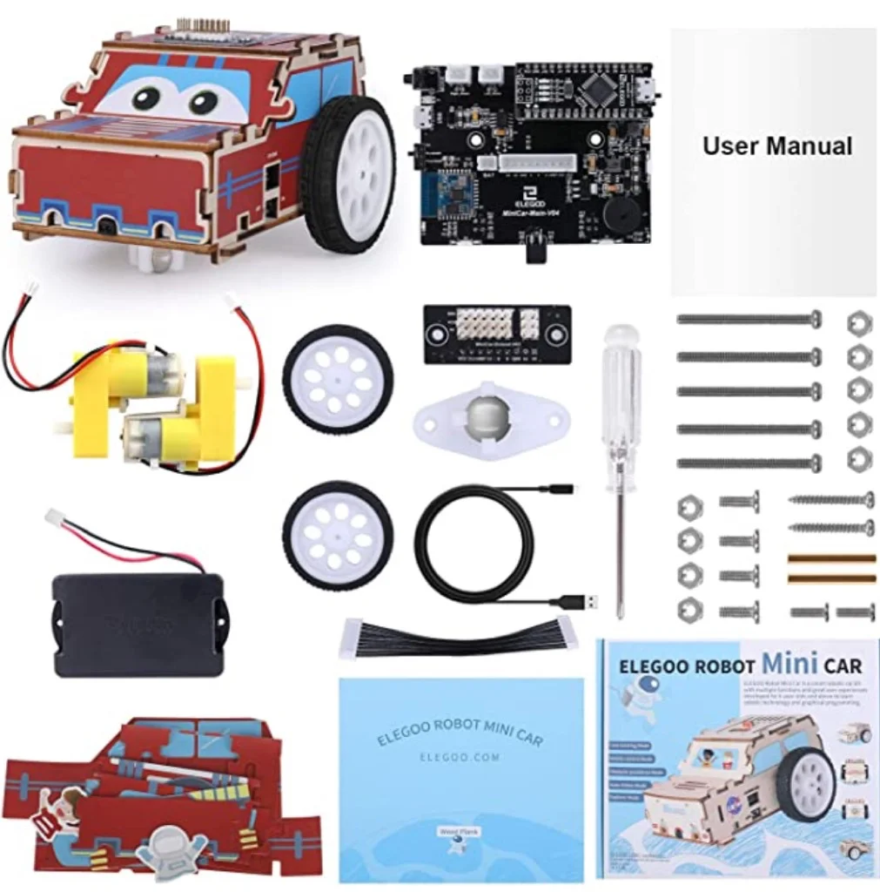

> dai 8 anni

Ci sono ormai dozzine di kit semplici per costruire automobiline che guidano da sole (con un sensore di luminosità) e controllabili via tablet/smartphone via bluetooth.

Questo kit, ad esempio, che si basa su una scheda Arduino completo, costa tipo 30 euro ed è fenomenale.
Facile da montare e ci si diverte a lungo. Ma sopratutto ogni volta che lo riprendi in mano si può imparare qualcosa.
Lasciamo stare le macchinine telecomandate mangia pile che dopo due giorni vengono abbandonate come in ToyStory 3

