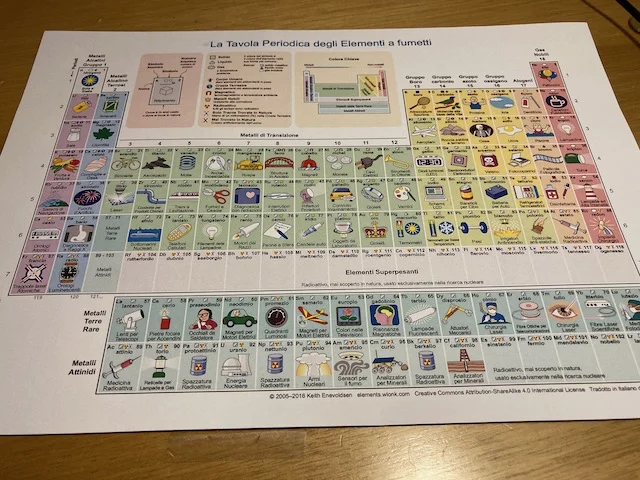

Qusta tabella è liberamente scaricabile come PDF e rappresenta tutti gli elementi chimici con dei chiarissimi riferimenti agli oggetti di uso quotidiano che li contengono.

Ci abbiamo discusso molto e potrebbe essere un simpatico regalo

vedi <https://stefano.cecere.org/post/alchimisti-con-regalo-per-i-ragazzi/>
