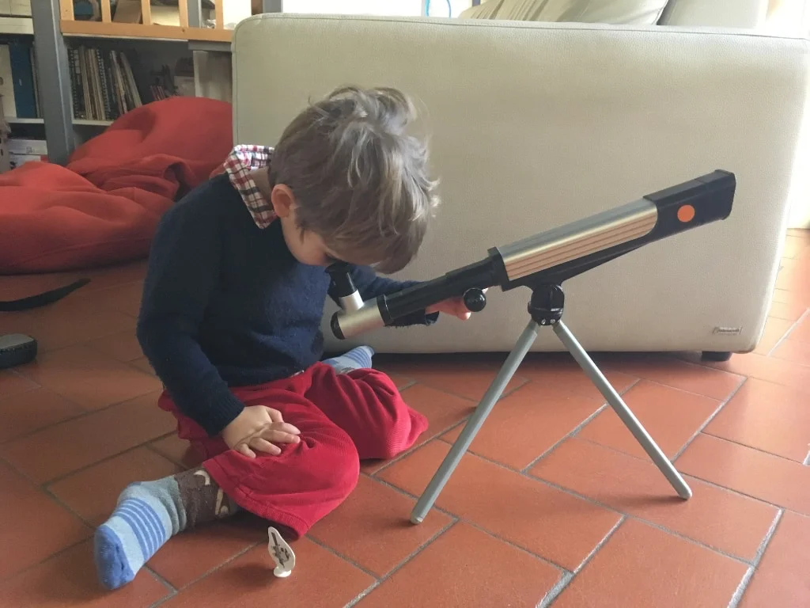

Un telescopio non dovrebbe mancare in nessuna casa, anche uno amatoriale va benissimo, giusto per guardare la Luna piena, Marte o la cima di una montagna.
E' stato lo strumento simbolo che ci ha portati fuori dal mondo, a cercare di capire se davvero eravamo al centro dell'universo o ci giravamo intorno, prendere un po' le misure con la grande casa, appunto.
E solo con questo oggetto in mano, osservando il cielo insieme ai nostri figli, potremmo iniziare a discutere di vita extraterrestre, di viaggi nella Galassia, del come è nato il Tutto e come finirà, del nostro Senso di esistere e stare qui.

> Fabio: abbiamo guardato la Luna!
{.boxFabio}
