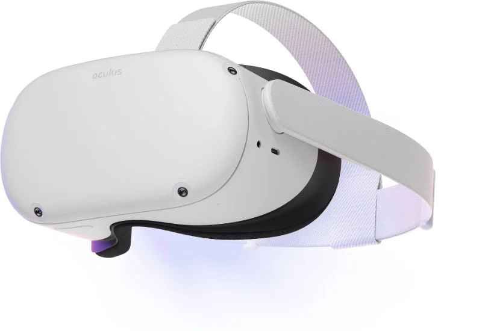
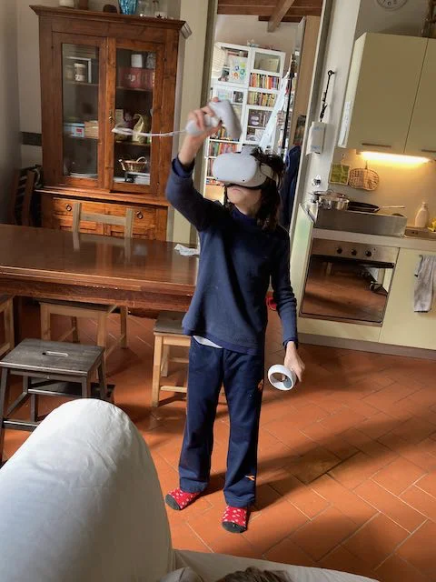
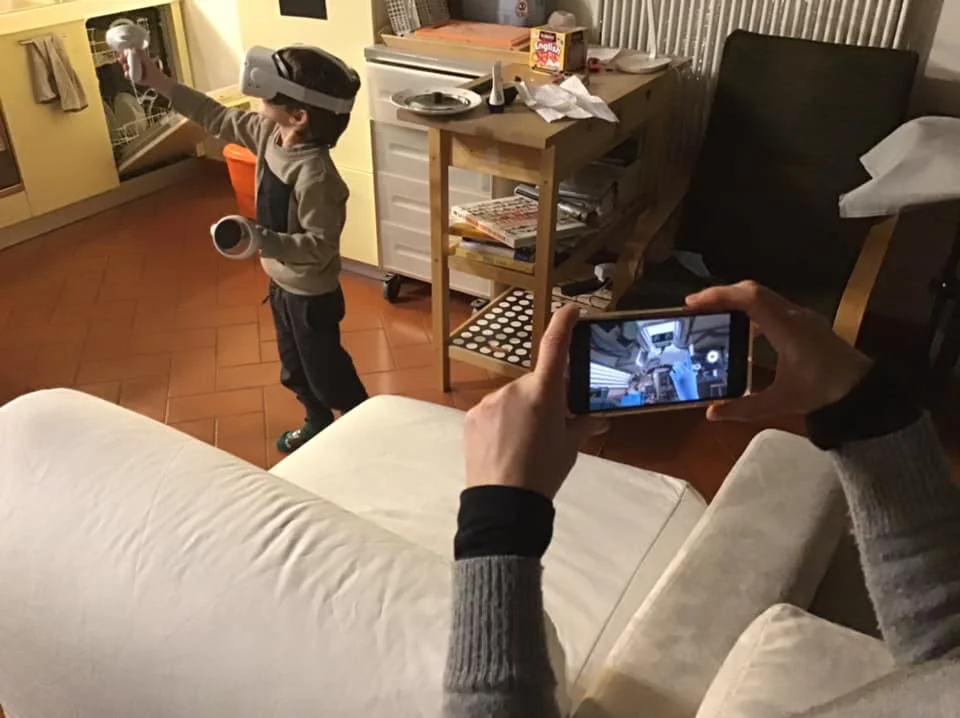

> la soluzione attualmente migliore è l'Oculus Quest 2

E' sicuramente una delle tecnologie più "impressionanti", perché va a cercare di sostituire, quasi a sabotare, i sistemi di percezione per immergerci e farci credere di essere altrove.
E dopo 30 anni di ricerca e sviluppo finalmente inizia ad essere davvero godibile da tutti, anche dai bambini.
Le uniche attenzioni sono sulle esperienze un po' troppo dinamiche (tipo montagne russe o giochi dove ci si sposta molto, o giochi fatti proprio male) perché il rischio di stare male è davvero alto.
Non ci si può stare a lungo.. dopo circa mezz'ora gli occhi potrebbero stancarsi, ma bastano e avanzano per provare qualcosa di nuovo.
E non ci sono solo giochi, ma anche strumenti creativi, dove ad esempio disegnare o scolpire, esperienze educative, viaggi, simulatori.. c'è davvero di tutto!

Il nuovo modello dell'Oculus, che è un visore indipendente (senza cavi al computer), permette anche la duplicazione dello schermo su un qualsiasi cellulare o tablet, così ad esempio un genitore può controllare o assistere i figli.

> Fabio: è davvero incredibile. faccio arrampicata con The Climb e gioco a The Room.. sembra proprio di essere lì!
{.boxFabio}

{: style="height:200px"}
{: style="height:200px"}
{: style="height:200px"}

