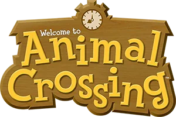
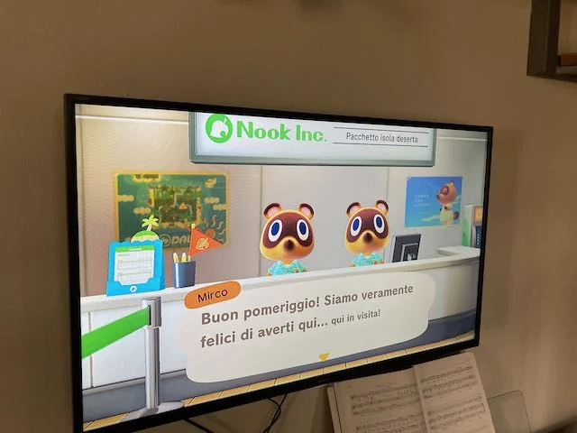
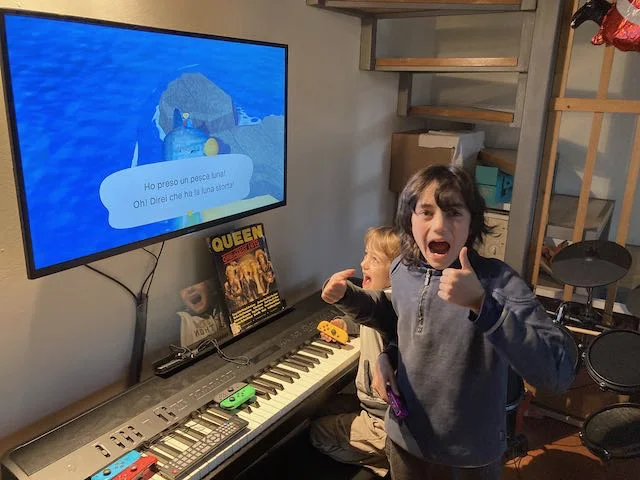

> [!info]
> #Award #Kids #Family  
> *Nintendo Switch* 

Un gioco pluripremiato e consigliato per i bambini dai 4 anni in su, perché permette di prendersi cura e costruire con grande calma la propria isola con animali, piante e amici.

> [!citation] Fabio
> ci gioca anche Bruno. abbiamo le nostre casette vicine e andiamo a cercare reperti per il museo archeologico o peschiamo pesci

