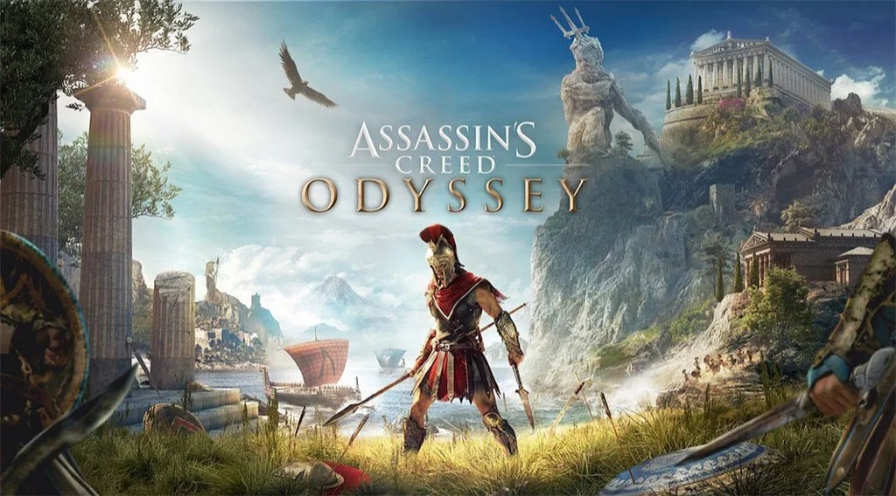

Solo per questo gioco non lasciatevi fuorviare dal PEGI:
ok sei un combattente ninja che viaggia nel passato a fare quello che deve fare (fai parte di una setta di Assassini...), ma il bello di questa serie di giochi è la ricostruzione storica che hanno fatto .che sia Firenze e Venezia del Rinascimento, l'Antico Egitto o Parigi... IMPRESSIONANTE.
una versione speciale (senza missioni assassine) è stata creata apposta per le scuole come percorsi didattici.

Go personalmente imposto a mio figlio di giocare questi giochi e di finirli stando molto attento agli scenari e all'atmosfera.

> [!tip] Fabio
> io che vivo a Firenze ho imparato molte cose, perché è proprio uguale!

