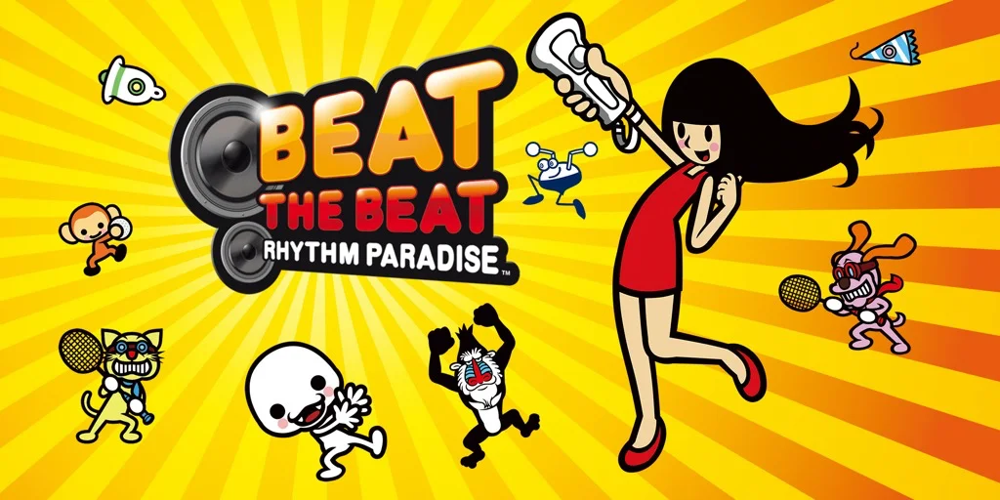

E' un gioco ritmico musicale che purtroppo non hanno rinnovato sulle nuove console (maledizione a queste evoluzioni tecnologiche che rendono facilmente ingiocabili i vecchi giochi!)
Ma ce ne saranno altri equivalenti.
Beat the Beat era un capolavoro in quanto i minigiochi non erano delle semplici tracce / canzoni da colpire a tempo, ma giochi veri e propri che necessitavano il giusto senso del ritmo.

Ci abbiamo giocato tantissimo.. e forse se oggi Fabio studia batteria e ha un innato senso del ritmo.. chissà..
