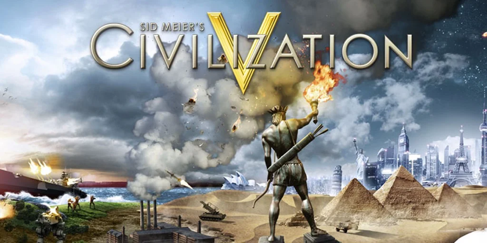

E' un gioco doppiamente storico:
1) ci giocavo già 30 anni fa e si è evoluto in 6 edizioni sempre più belle
2) tratta di evoluzione delle civiltà

Ok non ricostruisce gli eventi storici veri e propri, ma ti mette a capo di una delle dozzine di civiltà (dagli egiziani ai romani, dai mongoli agli aztechi agli indiani) e con il giusto equilibrio tra sviluppo urbano, economia, espansione territoriale, ricerca risorse, progressi scientifici e tecnologici, si evolve dalle palafitte alla conquista dello spazio.

Se c'è una cosa da capire con questo gioco è che la storia non è una linea temporale con sequenze di semplici causa -> effetto.
la Storia è un sistema molto complesso. possiamo farne delle istantanee, delinearne degli eventi chiave, ma l'intreccio tra economia, politica, società, cultura, religione, costume, scienza, tecnologia, eventi naturali.. è qualcosa di non riducibile
