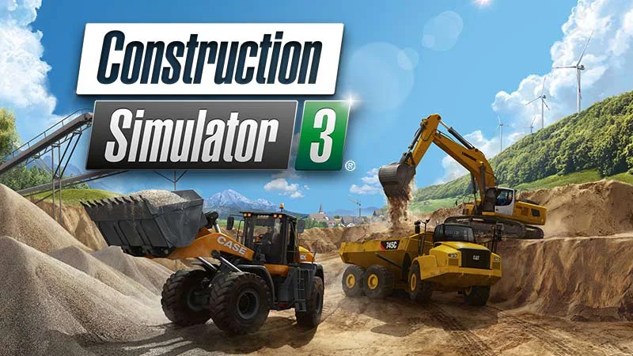
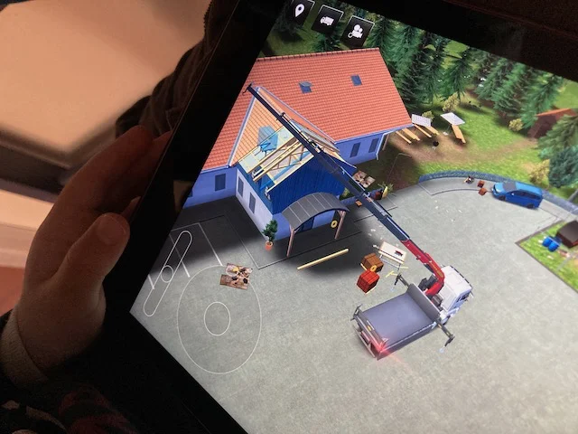
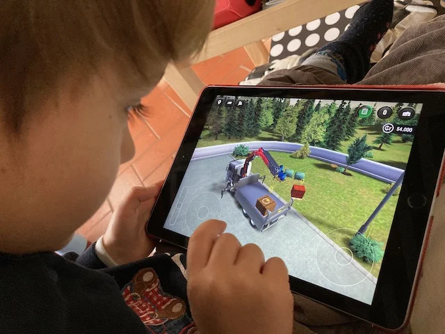

A chi non piacciono ruspe, escavatori e camion?
In questo "simulatore" apri una azienda edile, e lavoro dopo lavoro, con crescente difficoltà e avanzamento nei mezzi e tecniche, si impara a guidare camion, ruspe, escavatori, rulli.. sostituire tubi delle fognature o impiantare alberi, aggiustare tetti e costruire strade.

NO-TE-VO-LIS-SI-MO

> [!tip] Fabio
> è fatto benissimo con tutte i mezzi da lavoro e tantissimi lavori da eseguire
