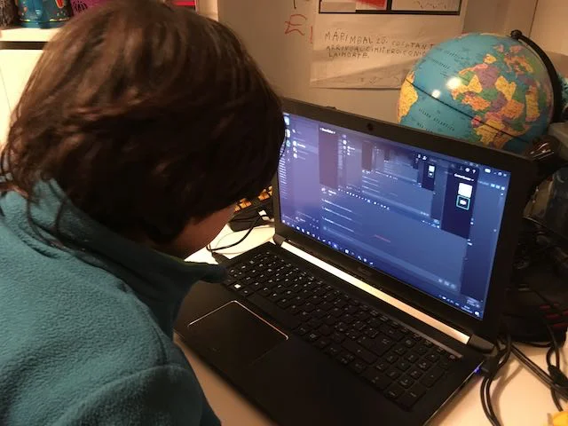

la piattaforma di discussione indispensabile per tutti i videogiocatori e ragazzi. gratuita, semplice.
Ognuno può creare un suo gruppo tra amici per discutere in audio, video, condividere schermo e files.
Viene usata anche al di fuori dei soli videogiochi, ad esempio per fare compiti o lavoro.

