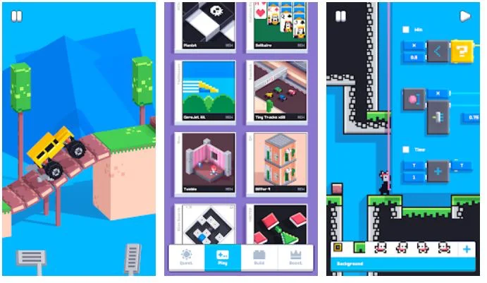

<iframe width="560" height="315" src="https://www.youtube.com/embed/yp4WaatgIC8?si=CHCym9JtmFLgXTpC" title="YouTube video player" frameborder="0" allow="accelerometer; autoplay; clipboard-write; encrypted-media; gyroscope; picture-in-picture; web-share" allowfullscreen></iframe>

I nostri giochi preferiti sono quelli semplici, veloci, ma intensi e possibilmente vari, che facciano riflettere o scoprire cose nuove.

Per questo suggeriamo un gioco per telefonino, gratuito (ha le pubblicità che si tolgono con un economico abbonamento) e presenta **centinaia di minigiochi di tutti i tipi:** da quelli logici a quelli di destrezza, solitari e sparatutto, con modalità avventura o sfida degli amici e piccoli premi quotidiani. Per noi una fonte di ispirazione infinita, anche perché ha un editor interno per creare e programmare nuovi giochi e ne arrivano di nuovi in continuazione. **Consigliatissimo sia per noi vecchi che per i ragazzi.**

> NB: Sto lavorando ad una piattaforma di minigiochi per l’auto-miglioramento, se vi interessasse saperlo, e vi consiglio anche questo nuovissimo [Puzzmo](https://puzzmo.com) di cui parlerò a tempo debito.

Il sito di questo gioco è [www.fancade.com](https://www.fancade.com/)
