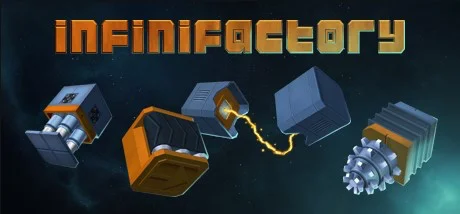

Avete mai progettato e costruito degli impianti industriali che producano quello che vi serve?
magari su un mondo alieno?
Immagino non capiti tutti i giorni.. ma sappiate che poterlo provare è davvero stimolante. Non è un gioco per tutti (di fatto è prodotto dalla Zachtronics che è specializzata in giochi relativamente cervellotici) ma provatelo!
Potreste trovarci a cenare pensando a come risolvere una catena di produzione tutti insieme!

> *Fabio:*
> mi piace costruire industrie scegliendo quali tra i tantissimi blocchi usare. mi ricorda Minecraft ma più tecnologico

