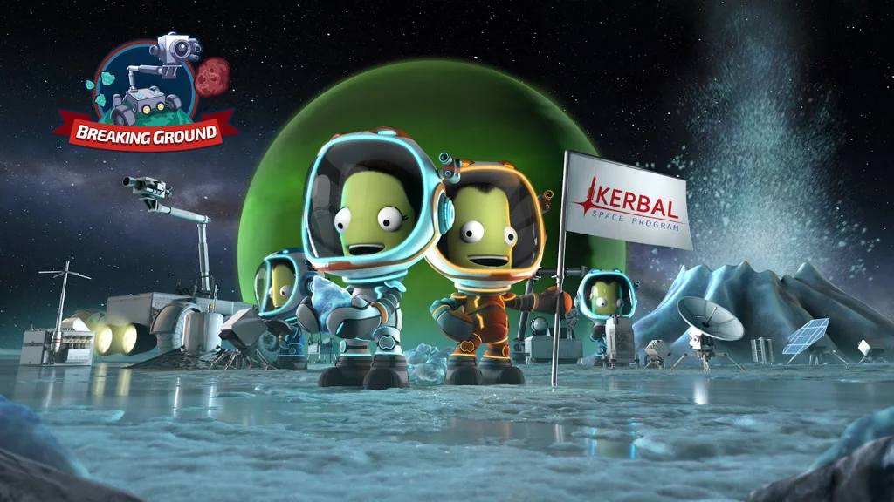

il più grande simulatore di Agenzia Spaziale.
progetti, costruisci, collaudi ogni mezzo volante e astronautico.
vai in orbita e fino sulla Luna o altri pianeti.
il tutto con un livello di simulazione realistica (per quanto riguarda motori, combustibili, procedure, aerodinamica)

inizi con poco e arrivi a ricreare la Space-X.
doveroso installarlo sui computer dei ragazzi
anzi: un motivo in più per dare loro un PC e non una consolle.

> *Fabio:*
> i personaggi sono simpatici, è fatto benissimo con tutti i possibili pezzi di costruzione ed è abbastanza difficile

