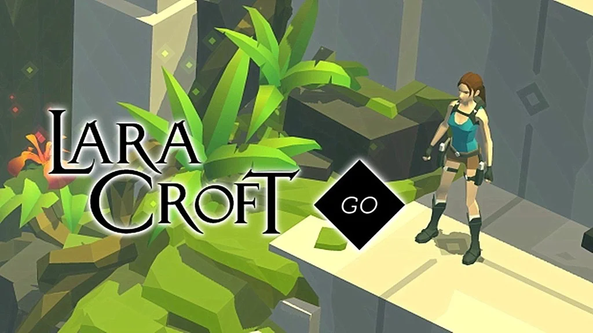

 

E' un gioco strategico a turni, dove in ogni mossa ti puoi spostare in una delle quattro direzioni.
Non mette fretta e si ha tutto il tempo per capire quale sarà la sequenza giusta per uscire dai livelli sempre più difficili.
Il gioco perfetto per sviluppare il pensiero logico e la preimmaginazione, con un personaggio (Lara Croft) e ambientazioni davvero accativanti.

> Ci gioca anche mio fratellino e secondo me gli fa davvero bene
