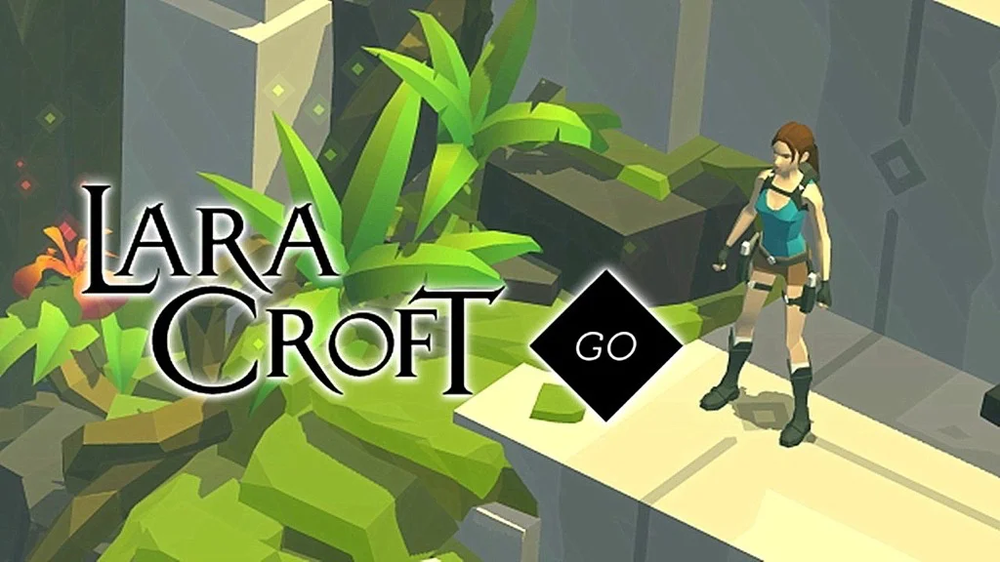

---
title: Lara Croft GO
slug: lara-croft-go
description: ""
categories: [videogame]
tags: [Puzzle, Tablet]
date: 2020-12-14
lastmod: 

template: played.html
played_category: videogame
played_skills: []
played_gameplay_complex: 
played_gameplay_strategy: 
played_gameplay_luck: 
played_gameplay_interaction: 

played_preferred: 
played_rank_edu: 
played_rank_dev: 
played_rank_kid: 

played_players: 
played_age: 
played_duration: 

played_publisher: 
played_year: 
played_url_details: https://en.wikipedia.org/wiki/Lara_Croft_Go
played_url_play: 
played_vg_platforms: [mobile]
--- 

E' un gioco strategico a turni, dove in ogni mossa ti puoi spostare in una delle quattro direzioni.
Non mette fretta e si ha tutto il tempo per capire quale sarà la sequenza giusta per uscire dai livelli sempre più difficili.
Il gioco perfetto per sviluppare il pensiero logico e la preimmaginazione, con un personaggio (Lara Croft) e ambientazioni davvero accativanti.

> Ci gioca anche mio fratellino e secondo me gli fa davvero bene
