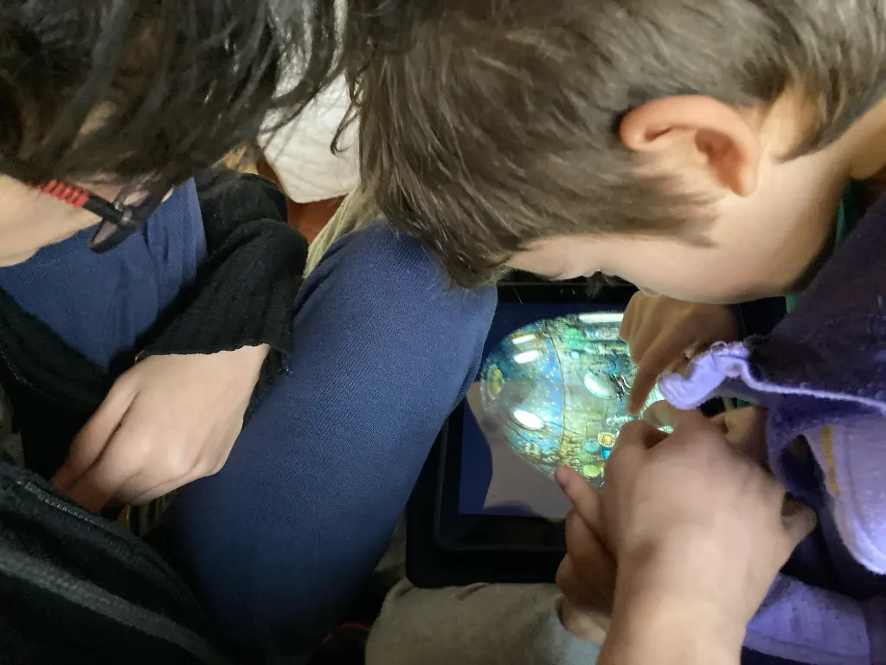

 
 <iframe width="960" height="600" src="https://www.youtube.com/embed/uwZBdWRSBRs" title="Machinarium - Official Trailer" frameborder="0" allow="accelerometer; autoplay; clipboard-write; encrypted-media; gyroscope; picture-in-picture; web-share" allowfullscreen></iframe>

 Fabio lo giocò a 8 anni, ora lo sta rigiocando Bruno sempre a 8.
 Avventura notevole: non banale, da fare insieme nei punti più difficili.

 C'è per tutte le piattaforme

