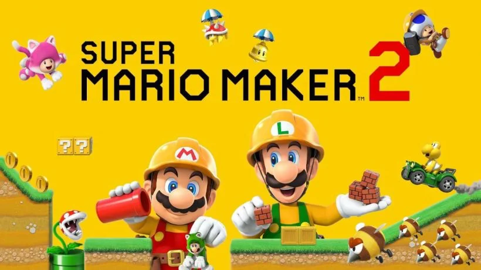

Vedere un bambino di 4 anni creare nuovi livelli di videogiochi, posizionando trappole, ostacoli, mostri e monete da raccogliere.. e poi presentartelo sfidandoti a risolverlo, non ha prezzo.

O meglio si, in prezzo ce l'ha, il costo di una Nintendo Switch e schedina.

Ci sono sempre più giochi che permettono di creare i propri livelli, ma questo Mario Maker ha raggiunto il migliore compromesso tra facilità e potenza e divertimento

> [!tip] Fabio
> mi piace costruire nuovi livelli con i tanti blocchi, e poi farli giocare agli amici e parenti

