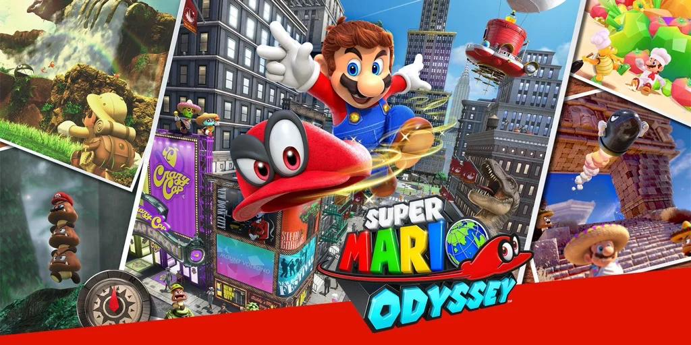

Uno dei giochi "perfetti". Non piacerà a tutti, ma ai bambini sì, e stare con loro mentre risolvono i vari livelli, è davvero divertente. Eventualmente si gioca anche in due (il genitore può controllare il cappello di Mario) e godersi una sana mezz'ora di interazione ludica.

I livelli / mondi sono molto vari, le musiche davvero belle, e le difficoltà adeguate con centinaia di tipi diversi di ostacolo da superare, per stimolare ed allenare ogni parte del cervello: destrezza, ritmo, spazialità, memoria, correlazione...

In più c'è la modalità "assistita" ottima per i bambini più piccoli, e molti sottolivelli opzionali.

> *Fabio:*
> è un'avventura estesa su tantissimi mondo, la storia è bella, e una volta finita la missione principale vai a caccia di lune.
