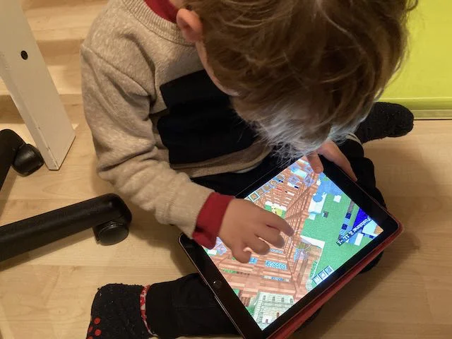

Giocare a Minecraft è esattamente l'equivalente del giocare al LEGO.

Oggi che i confini digitale / analogico, reale / virtuale, gioco / educazione sono molto fluidi, e le nuove generazioni non li vedono, Minecraft è de facto il gioco popolare più diffuso al mondo.

Per quanto mi riguarda: più ci giocano, meglio è. sia in creativa che in sopravvivenza, sopratutto se online con amici.

> *Fabio:*
> costruisci un sacco di cose, da solo o con gli amici, è estremamente creativo.

